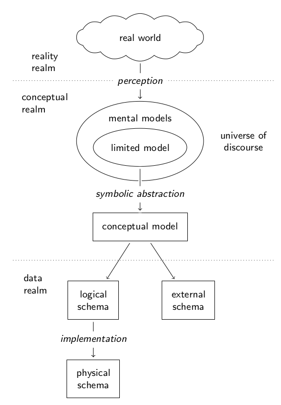
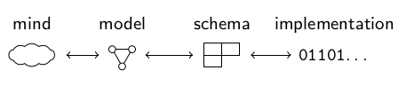

# Data modeling and semantics {#data-modeling}

*This section will describe basic of data modeling and the nature of structured data.*

## Notions of Data

...

## Data modeling

### Theory

*This section still needs to be simplified and extended by examples!*

The set of activities required to design a database or data format is called
**data modeling**. Theoretical foundations of data modeling and have been laid
out in the 1970s [@CODASYL1971; @Steel1975b]. It defines the basic concepts
which are still used today (with different meanings because the original
sources are unlike read today).  As surveyed by @Simsion2007 [p. 34ff.] the
data modeling terminology differs, especially between academic and
practitioners, but also within communities.  Nevertheless there is a rough
consensus to differentiate three "realms of interest" which are the real world;
ideas about the real world existing in the minds of men; and symbols on some
storage medium representing these ideas [@Steel1975b p. II-1]. Data modeling
then includes several stages from one realm of interest to the next, possibly
with sub-steps [@Simsion2007 ch. 3.1] and several levels of description for
different stages and applications [@Kent1978 ch. 2.2.2].

Figure XXX shows a synthesis of data modeling process frameworks from across
the data modeling literature. It is mainly based on [@Simsion2007 fig. 3-1] who
gives an in-depth review of literature and on [@Steel1975 fig. 2].[^1] A common
model of reality that exists in our minds, shared between individuals via any
language, is called *universe of discourse*. We can only express a limited
model and try to formally capture it as *conceptual schema* in a *conceptual
model*. Conceptual models are also called 'domain models' or 'semantic data
models' [@Hull1987; @Peckham1988] and come with a graphical notation for better
understandability. Most conceptual modeling techniques are based on or
influenced by the *Entity-Relationship Model* (ERM) [@Chen2007]. 
The terms 'model' and 'schema' are often used synonymously with connotation on
expression for schemas or on meaning for models. A conceptual model can be
expressed as in a *logical schema*. It is also called *external schema* if it
only covers parts of a conceptual model (as 'views' to the full model) or if it
is not primarily meant for storing data. Both logical and external schema must
be implemented in a to actually hold data. If data is stored as database, a
typically DMBS implements the physical level so users can work on the physical
schema. External models can also be realized as data formats and formal
ontologies. Examples of languages to express logical and external schemas are
SQL, XSD, and RDFS.

It is important to recognize that each step includes a feedback loop to
the prior level of description: constraints of physical schemas
influence logical schemas, logical schemas affect conceptual models, and
reality is perceived and changed to better fit existing mental models,
as language affects the way we think [@Whorf1956]. Modelers and
architects of information systems often ignore these feedbacks, although
it can even cascade through multiple levels. If something cannot be
expressed within the artificial boundaries of a system, we often
mistakenly assume that is does not exist. In practice data is often
created and shaped without a clean, explicit data modeling process.
Instead of reflecting mental models, data modeling then starts with a
conceptual model or even directly with a logical schema or
implementation [@Simsion2007]. One can therefore simplify the data
modeling process in four levels: mind (reality and mental models), model
(conceptual model), schema (logical and external schemas), and
implementation (physical schemas) as shown in figure YYYY.

[^1]: @Steel1975 [fig. 2] has a better view of @Steel1975b
    [fig. VIII 5.1]. Most later works combine realm of reality and
    conceptual realm into the conceptual model and concentrate on data
    realm.

### Practice

*List and examplain data modeling and schema languages, maybe better in one section*

